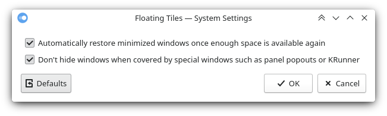

# Floating Tiles: no-stacking stacking window management for KWin

Extension for KDE's window manager to make windows non-overlapping, by automatically minimizing a window when it gets covered by another window, and optionally restoring it when space becomes available again.

This is intended to keep the workspace clutter-free while maximizing screen real estate and retain the user in full control over window and workspace management, aiming to combine the efficiency of a tiling layout with the flexibility of freely positionable floating windows.

Note that this script is an extension to be run on top of KWin and not a standalone window manager, and will also not do any automatic tiling.

Overlap prevention will only take effect between toplevel windows and not e.g. hide a parent window when a dialog opens. By default, special windows not associated with any regular window such as panel popouts or KRunner will be ignored as well; this can be changed in the configuration.

By default, any window that has been automatically minimized will be automatically restored once the space above it is free again; this can be disabled in the configuration.




[view in KDE Store](https://www.pling.com/p/1619690/)

## Installation

### Dependencies

`kwin` version ≥ 5.21.

### Method 1: via graphical interface

1. Install the script via *System Settings* > *Window Management* > *KWin Scripts* > *Get New Scripts …* > search for *Floating Tiles* > *Install*.
2. Activate the script by selecting the checkbox in the *Floating Tiles* entry.

### Method 2: via command line

```bash
git clone https://github.com/nclarius/floating-tiles.git
plasmapkg2 --type kwinscript -i floating-tiles
kwriteconfig5 --file kwinrc --group Plugins --key floatingtilesEnabled true
qdbus org.kde.KWin /KWin reconfigure
```

## Configuration

*System Settings* > *Window Management* > *KWin Scripts* > configuration button in the *Floating Tiles* entry.

You may have to disable the script, apply, reenable, and reapply in order for the changes to take effect.

If the configuration button is missing, try the following:

````bash
mkdir -p ~/.local/share/kservices5
ln -sf ~/.local/share/kwin/scripts/floatingtiles/metadata.desktop ~/.local/share/kservices5/floatingtiles.desktop
````

## Usage

### Known issues

- With auto-restore enabled, when using the Minimize All plasmoid, windows that had already been minimized automatically will be unwantedly unminimized.


## Small Print

© 2021 Natalie Clarius \<natalie_clarius@yahoo.de\>

This work is licensed under the GNU General Public License v3.0.  
This program comes with absolutely no warranty.  
This is free software, and you are welcome to redistribute and/or modify it under certain conditions.  

If you would like to thank me, you can make me happy by [leaving a review](https://store.kde.org/p/1619690) or [buying me a cup of tea](https://www.buymeacoffee.com/nclarius).

