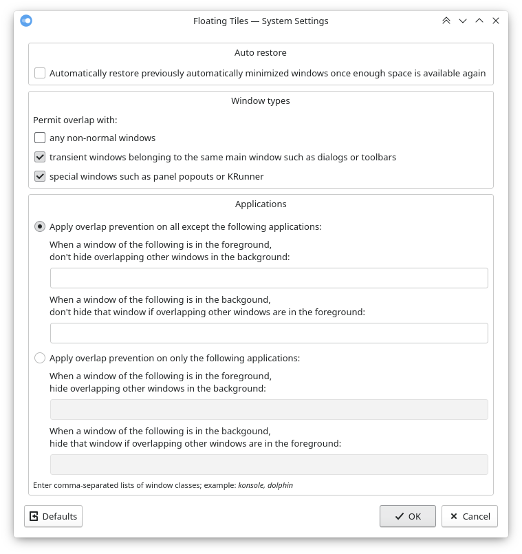

# Floating Tiles: no-stacking stacking window management for KWin

[latest release](https://github.com/nclarius/floating-tiles/releases/latest) | [view in KDE store](https://store.kde.org/p/1619690)

Extension for KDE's window manager to make windows non-overlapping, by automatically minimizing a window when it gets covered by another window, and optionally restoring it when space becomes available again.

This is intended to keep the workspace clutter-free while maximizing screen real estate and retain the user in full control over window and workspace management, aiming to combine the efficiency of a tiling layout with the flexibility of freely positionable floating windows.

Note that this script is an extension to be run on top of KWin and not a standalone window manager, and will also not do any automatic tiling.

The windows to be affected can be filtered by window type and application. 

By default, any window that has been automatically minimized will be automatically restored once the space above it is free again; this can be disabled in the configuration.




## Installation

### Dependencies

`kwin` (tested with version 5.26 on X11).

### Installation via graphical interface

1. Install the script via Discover or *System Settings* > *Window Management* > *KWin Scripts* > *Get New Scripts …* > search for *Floating Tiles* > *Install*.
2. Enable the script by activating its checkbox, and apply the settings.

### Installation via command line

```bash
git clone https://github.com/nclarius/floating-tiles.git
cd floating-tiles
./install.sh
```

## Configuration

*System Settings* > *Window Management* > *KWin Scripts* > configuration button in the *Floating Tiles* entry.

You may need to uncheck the checkbox for the script, apply the settings, recheck, and reapply in order for the changes to take effect.

In Plasma versions < 5.24, a bug in the KWin scripting system [[1]](https://bugs.kde.org/show_bug.cgi?id=411430) [[2]](https://bugs.kde.org/show_bug.cgi?id=444378) may cause the configuration not to be found. To fix this, please execute the following commands in a terminal:

```bash
sed -i 's/ConfigModule/Library/g' ~/.local/share/kwin/scripts/floatingtiles/metadata.json
mkdir -p ~/.local/share/kservices5/
ln -sf ~/.local/share/kwin/scripts/floatingtiles/metadata.json ~/.local/share/kservices5/floatingtiles.json
qdbus org.kde.KWin /KWin reconfigure
```

To find the window class name of an application: Right-click on the titlebar of a window of the application > *More Actions* > *Configure Special Application Settings...* > the pre-filled entry in *Window class (application)* (if it consists of two words, only the second part) is the window class to put in the script configuration.

## Usage

### Known issues

- With auto-restore enabled, when using the Minimize All plasmoid, windows that had already been minimized automatically will be unwantedly unminimized.
- The configuration interface is clunky; buttons do not always appear highlighted as intended.


## Small Print

© 2021-2022 Natalie Clarius \<natalie_clarius@yahoo.de\>

This work is licensed under the GNU General Public License v3.0.  
This program comes with absolutely no warranty.  
This is free software, and you are welcome to redistribute and/or modify it under certain conditions.  
If you would like to thank me, you can always make me happy with a review or a cup of coffee:  
<a href="https://store.kde.org/p/1619690"></a> <a href="https://www.paypal.com/donate/?hosted_button_id=7LUUJD83BWRM4"></a>&nbsp;&nbsp;<a href="https://www.buymeacoffee.com/nclarius"></a>
